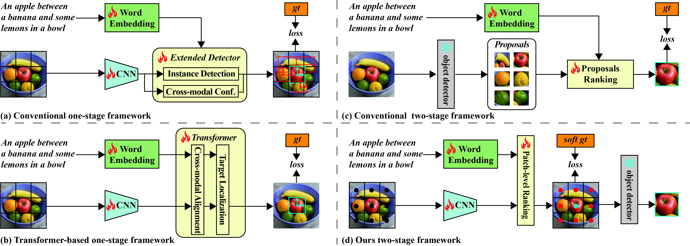

# PBREC-MT
code for Rethinking Two-Stage Referring Expression Comprehension: A Novel Grounding and Segmentation Method Modulated by Point

  

## Train Step
### 1 Dataset Prepare 

The dataset can be downloaded via:
referring expression comprehension annotations from: https://github.com/lichengunc/refer
and this is the link
https://bvisionweb1.cs.unc.edu/licheng/referit/data/refclef.zip
https://bvisionweb1.cs.unc.edu/licheng/referit/data/refcoco.zip
https://bvisionweb1.cs.unc.edu/licheng/referit/data/refcoco+.zip
https://bvisionweb1.cs.unc.edu/licheng/referit/data/refcocog.zip

photos are from https://cocodataset.org/#home
and the link is : http://images.cocodataset.org/zips/train2014.zip

### 2 Training

use 'nohup ./train.sh > ./log/refcoco.log 2>&1 &' to run train.sh' to run training

### 3 Inference

After the model has finished training, for a given input sample, the model will output a probability tensor of shape (400,). This corresponds to the predictions for each region block in the object detectors SOLO and FCOS, where each block has one prediction value (either a bounding box or a mask).
SOLO: https://github.com/WXinlong/SOLO
FCOS: https://github.com/tianzhi0549/FCOS (In SOLO, due to varying scales, linear interpolation is used to meet the scale requirements of SOLO.)

### 4 IOU-NMS

Based on the settings of the hyperparameters, we will obtain N boxes, which will then undergo post-processing using the IOU-NMS method we proposed.

